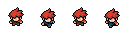
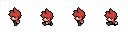
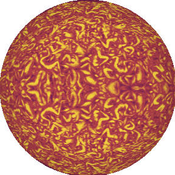
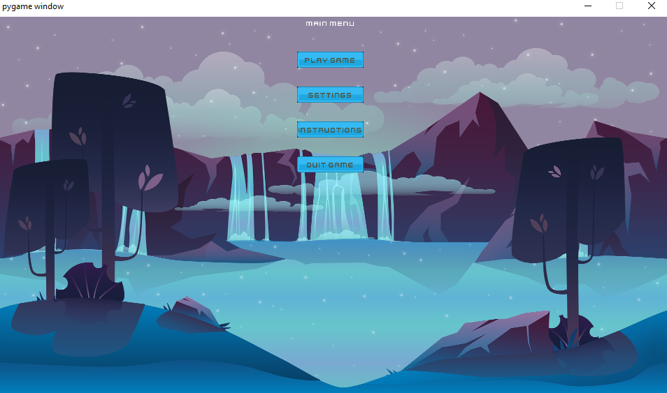
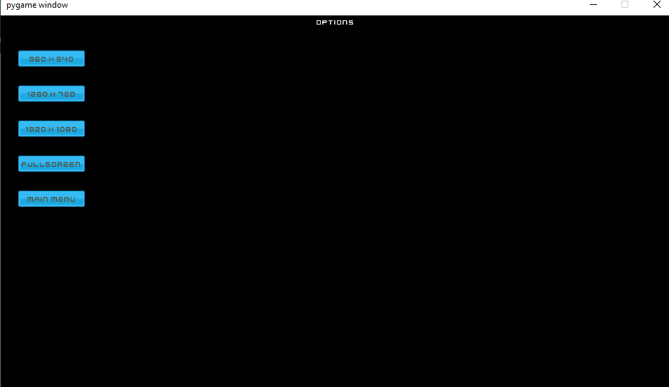
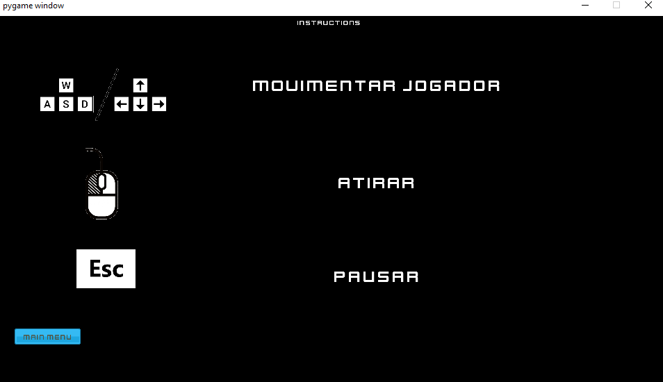

# Boss Slayer: nosso projeto de ces-22

## Introdução

Boss Slayer é um jogo do estilo bullet hell com visão top-down para 1 player, onde o herói é desafiado a enfrentar bosses extremamente difíceis. Nosso jogo se baseia em um outro jogo chamado **Titan Souls**. Nele, o objetivo do herói é, resumidamente, matar bosses obscenamente fortes de maneira inteligente com um único 'hit'.

Algumas sprites do nosso herói (disponíveis gratuitamente na internet):

Para isso, o nosso herói conta com alguns movimentos: o herói pode andar (uhul!), atirar e **voltar no tempo**. O herói se torna invencível durante a volta no tempo, podendo atravessar projéteis inimigos.

Sintetizando: o jogo exige que o jogador consiga desviar de vários projéteis, atirar nos pontos fracos e usar a habilidade de voltar no tempo para sobreviver!

## Requisitos

O jogo foi desenvolvido em python3 majoritariamente em sistemas Linux mas idealmente deve rodar em qualquer SO com python3.

Requisitos:

* python3
* pygame==1.9.6
* numpy==1.17.2
* pygame_gui==0.5.5

## Como jogar

Basta baixar o repositório e rodar o script 'start_game.sh' na pasta raíz do repositório.

Os comandos são simples: WASD para andar, botão esquerdo do mouse para atirar (mira com o próprio cursor) e R para voltar no tempo.

## Detalhes técnicos

Ok, aqui é onde a coisa fica complexa.

Em primeiríssimo lugar, a função Main do programa se encontra na pasta [**src**](/src). Ela é responsável por instanciar a classe GameManager e, então, começar o jogo.

Ainda dentro de [**src**](/src) existe a pasta [**classes**](/src/classes) que reune as principais classes explicadas abaixo:

### GameManager

Classe responsável por gerenciar os estados do jogo. (jogando, em tela de início, tela de morte, tela de vitória...)

Também é responsável por iniciar instâncias das telas, cuidar das configurações (resolução), iniciar o jogo e música.

### GameObjects

É a classe de todos os objetos que são desenhados dentro do jogo e podem sofrer colisão.

### Principais Game Objects

#### Hero

Classe do nosso herói. Ela possui as sprites, tempo mínimo entre disparos, velocidade do player e dos disparos, lista de sprites e posições passadas para a reconstrução do caminho durante a volta no tempo.

Ela é a responsável pelo herói e suas ações como um todo.

#### Boss_1

Classe do primeiro e, infelizmente, único boss do jogo.

A ideia era fazer um olho, mas não conseguimos desenhar os sprites bem o suficiente (faltou um time de arte), então nosso boss 1 é o sol mesmo.

Guarda e atualiza informações sobre o boss, seus pontos fracos e seus projéteis.

A IA do boss é simples: o comportamento principal é seguir o player até a velocidade constante com intenção de esbarrar com ele (matando-o). Além disso, atirar um número aleatório de projéteis ao redor em intervalos de tempos também aleatórios.

#### BossEye e WeakPoint

 

São duas classes auxiliares de GameObjects que são os dois pontos fracos do boss. O primeiro, ao ser atingido, ativa o estado de fúria do boss que dispara um laser rotativo impossível de desviar (a menos pelo uso da técnica de voltar no tempo). O segundo, ao ser atingido, dará a vitória para o jogador!

#### Bullet

#### Laser

### Screens

#### MenuScreen

Classe responsável pelo menu inicial e botões PLAY, OPTIONS, INTRUCTIONS E QUIT. Ao ir de outra tela para ela as variaveis do jogo são reiniciadas.

### OptionsScreen

Classe responsável pela tela de opções de resolução.

#### IntructionsScreen

Classe responsável pela tela de instruções de como jogar.

#### PauseScreen

Classe responsável pela tela de pausa e seus botões RESUME e MAIN MENU.

#### GameOverScreen

Tela de derrota para os que não resistiram aos poderes do nosso boss. Apresenta o score do jogador e é  responsável pelos botões MAIN MENU E QUIT.

#### WinScreen

Tela de vitória para os destemidos que conseguiram derrotar o boss. Responsável pelos botões MAIN MENU e QUIT.

#### GameScreen

Classe principal quando falamos do jogo rodando. Ela mantém o loop principal do jogo em andamento.

Foi uma das primeiras classes desenvolvidas e, por isso, acabou virando uma superclasse.

Em resumo: ela instancia todos os [GameObjects](###GameObjects) importantes (Hero, Boss, projéteis), faz contagem da fase atual (apesar do jogo atualmente só ter uma fase), pega as informações dos periféricos (como botões pressionados e clicks de mouse) e cuida do tratamento das colisões e de desenhar os [GameObjects](###GameObjects).

## Obrigado por jogar!

Time:

    * Due Jie Wan (Obi Wan)
    * Fernanda Rodrigues (Nanda)
    * Gustavo Vieira (Montanha)
    * Nickolas Baptista (Mister)
